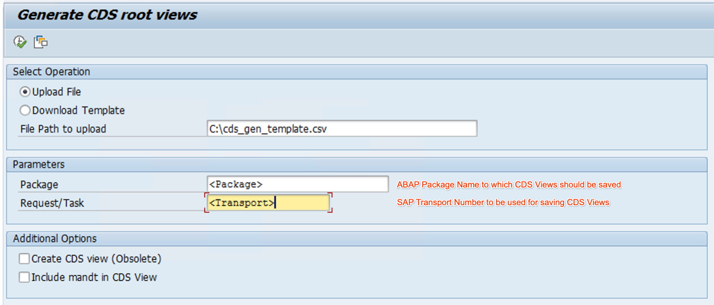
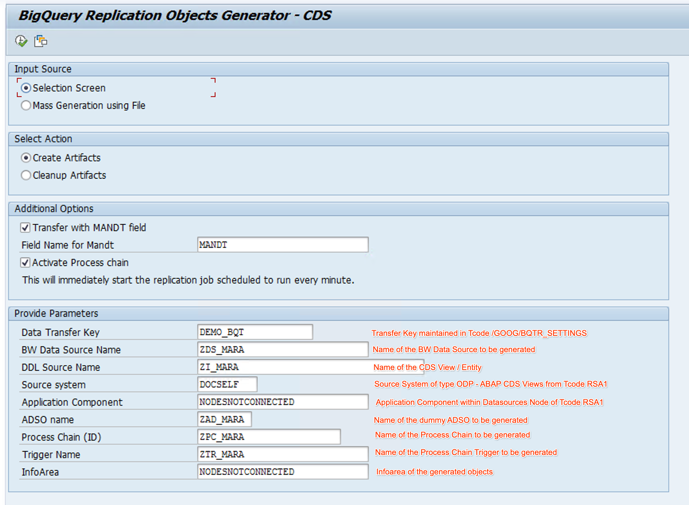
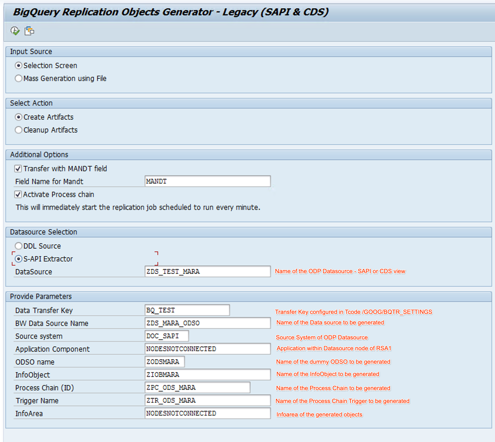
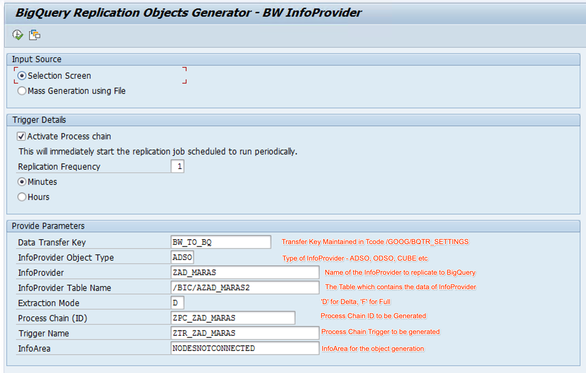
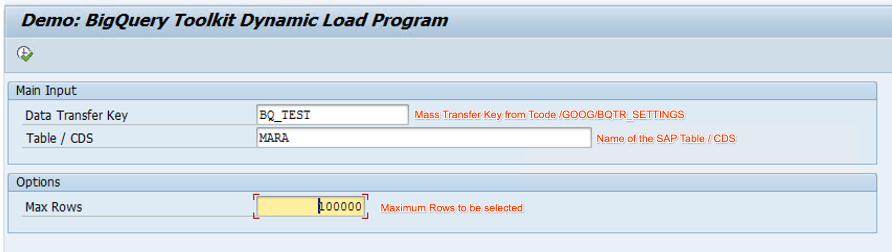

#  BigQuery Toolkit for SAP - Replication Objects Generator

> 📢 🚀[Annoucing Generators for SAPI and CDS Extractors in legacy SAP systems](#23---legacy-replication-objects-generator) 

## Introduction
The tools in this repo allow you generate required objects and boilerplate code for establishing a data replication pipeline from SAP into BigQuery by utilizing [BigQuery Toolkit for SAP](https://cloud.google.com/solutions/sap/docs/abap-sdk/on-premises-or-any-cloud/latest/bq-toolkit-for-sap-overview)  

BigQuery Toolkit for SAP is a set of opinionated utilities, which can be used to programmatically access BigQuery resources from SAP without having to manually write code for common operations such as Table definition sync, SAP to BigQuery Data type mapping, Data chunking, Data Transfer and error handling. BigQuery Toolkit can be used within custom SAP applications such as BADIs, Enhancements, User Exists and standalone programs.

By calling the BigQuery Toolkit Data Load Class from within a Data extraction mechanism of SAP ERP, you can establish a real-time data replication from SAP to BigQuery

## Overview
This repo includes tools designed to simplify and accelerate the process of extracting data from SAP systems and loading it into Google BigQuery by utilizing Datasources. These tools offer the following benefits -
- Reduced Development Effort: Automates the creation of CDS views / entities and extraction objects, saving developers significant time and effort.
- Simplified Data Export: Provides a streamlined mechanism for exporting data from SAP to BigQuery.
- Increased Efficiency: Automated processes and scheduling capabilities improve the efficiency of data transfer.
- Accelerated Time-to-Production: Reduces the overall time required to set up and deploy data pipelines from SAP to BigQuery.
- Open-Source and Extensible: The open-source nature of the tools allows for community contributions and future extensions.

## Table of contents

 - [Introduction](#introduction)
 - [Overview](#overview)
 - [Table of Contents](#table-of-contents)
 - [1 - Installation](#1---installation)
   - [1.1 - Compatibility](#11---compatibility)
   - [1.2 - Pre-requisites](#12---pre-requisites) 
 - [2 - How to Guide](#2---how-to-guide)
   - [2.1 - CDS View Generator](#21---cds-view-generator)
   - [2.2 - Replication Objects Generator](#22---replication-objects-generator)
   - [2.3 - Legacy Replication Objects Generator](#23---legacy-replication-objects-generator)
   - [2.4 - BW InfoProvider Replication Objects Generator](#24---bw-infoprovider-replication-objects-generator)
   - [2.5 - Dynamic Load Program](#25---dynamic-load-program)
 - [3 - Operations Guide](#3---operations-guide)

## [1 - Installation](#table-of-contents)
You can import objects of this repo into your system by using abapGit. Alternatively, you can import the Transport Request attached to the [release](https://github.com/GoogleCloudPlatform/abap-sdk-bigquery-toolkit-samples/releases) into your system by using STMS.

### [1.1 - Compatibility](#table-of-contents)
 - CDS Replication Object Generator is compatible with S/4HANA 1909 and higher.
 - Legacy (SAPI) Replication Objects Generator  is compatible with all ERP systems

### [1.2 - Pre-requisites](#table-of-contents)
The following steps should be completed before using B/W Generator
- [ABAP SDK for Google Cloud On-prem or Any-cloud edition](https://cloud.google.com/solutions/sap/docs/abap-sdk/on-premises-or-any-cloud/latest/install-config), V1.9 or higher is installed in your SAP system
- [BQ Data Transfer Configuration](https://cloud.google.com/solutions/sap/docs/abap-sdk/on-premises-or-any-cloud/latest/bq-toolkit-for-sap-configuration) is completed by using Tcode /GOOG/BQTR_SETTINGS
- The ERP system is set up as BW Source System in Tcode RSA1 for various Data Sources.

## [2 - How to Guide](#table-of-contents)
The typical user flow for utilizing the tools in this repository is as follows:

### [2.1 - CDS View Generator](#table-of-contents) 
CDS View Generator program ZGOOG_R_BQTR_GEN_MASS_CDS_VIEW can be used to create delta enabled CDS View or CDS entity for transparent tables in SAP. 

Input Parameters:
 ​​- Select .csv file - Enter a file that is stored in your computer. The file should have 2 columns with values separated by commas
   - SAP Tablename
   - CDS Entity / View Name
   - SQL View Name (Optional, only required if you want to generate CDS Views, which are obsolete)
 - Enter the appropriate Package to which Generated CDS object should be saved
 - Enter Request/Task to be used for saving the CDS Object

Optionally, enable the following check-boxes as needed
 - Create CDS View(Obsolete). If not enabled, CDS Root View Entity will be created.
 - Include mandt in CDS view. If enabled, mandt field will be included in CDS View. 

Upon running, the program will generate CDS Object specified in the file. In case of errors, they will be displayed in the output. 

### [2.2 - Replication Objects Generator](#table-of-contents) 
The program ZGOOG_R_BQTR_GEN_REPL_OBJECTS will generate the following data replication objects for each CDS Object specified in the input.  
 - BW (CDS) Datasource
 - Advanced Data Store Object (ADSO)
 - Data Transfer Process (DTP)
 - Data Transformation
   - BW Start Routine
   - BW End Routine
 - Process Chain to auto-trigger DTP when there is a change in source data

Note: Within this tool, you can choose to include the client field from your SAP system as the first column of the BigQuery table. To do this, simply select the "Transfer with MANDT field" checkbox. If your SAP table uses a different name for the client field (such as RCLNT for the ACDOCA table) instead of the standard MANDT, you must specify that name in the corresponding field on the screen. The generated code will then use the correct client field name for the data transfer.

Within Start Routine, the generated code will call the BigQuery Toolkit Data Load Class /GOOG/CL_BQTR_DATA_LOAD to load the data into BigQuery.
Within End Routine, the RESULT_PACKAGE[] is cleared, ensuring no data is written to ADSO. 

You can run Replication Objects Generator with following input sources -
 - Selection screen: With this option, you pass the names of the parameters including the objects to be generated as selection screen parameters
 - Mass Generation using file: With this optuon, you provide a file containing one or more data sources for which B/W Objects should be generated. 
  - You can download a template by selecting the Radio-button 'Download Template'. This template can then be populated with Data sources and used as the input file when executing with radio-button 'Upload File'

The Replication Objects Generator supports the following actions -
 - When 'Create Artifcats' radio-button is selected, B/W objects will generated. Before running this action, you must ensure that there are no existing objects with the same name
 - When 'Cleanup Artifacts' radio-button is selected, existing B/W objects will be deleted from the system. 
  - Within this option, you also have flexibility to only delete certain B/W Objects or all the B/W objects by selecting the appropriate radio-button within box 'Select Artifacts for action'

As CDS Views typically do not include the Client (MANDT) field, you can generate code to include the client of the current system as the first column of the BigQuery table by Selecting 'Transfer with MANDT field' check box and entering the name of MANDT field. 

When you run the B/W Generator program, it will perform the corresponding action entered in the selection screen and display an action log along with success or error messages. In case of errors, please review your input and perform necessary corrective actions. 

**For a demonstration of data replication from SAP to BigQuery using the BigQuery Toolkit, please see this video:** 

### [2.3 - Legacy Replication Objects Generator](#table-of-contents) 
You can use the program [ZGOOG_R_BQTR_GEN_REPL_OBJ_LEG](/src/zgoog_r_bqtr_gen_repl_obj_leg.prog) to generate replication objects for SAPI and CDS Extractors in legacy systems such as SAP ECC. 

.

### [2.4 - BW InfoProvider Replication Objects Generator](#table-of-contents) 
You can use the program [ZGOOG_R_BQTR_GEN_REPL_OBJ_BW](/src/zgoog_r_bqtr_gen_repl_obj_bw.prog) to generate replication objects for BW InfoProviders such as ADSO, ODSO, CUBE etc.

.

### [2.5 - Dynamic Load Program](#table-of-contents)
The program [ZGOOG_R_BQTR_DEMO_DYN_LOAD](/src/zgoog_r_bqtr_demo_dyn_load.prog.abap) demonstrates how you can directly load data from a SAP table or CDS View into BigQuery by using BigQuery Toolkit 

## [3 - Operations Guide](#table-of-contents)

### Data Transfer Performance
You can utilize [SAP BW Parallel Processes](https://help.sap.com/doc/saphelp_nw74/7.4.16/en-us/48/807834109a1b5ae10000000a42189c/frameset.htm) to increase the performance of Data Transfer to BigQuery

### Migrate Data Transfer Objects to Test and Production
Follow the general instructions of [SAP BW](https://help.sap.com/doc/saphelp_nw74/7.4.16/en-US/4a/780dfc3109731ee10000000a42189c/frameset.htm) to transport BW objects into subsequent environments
 
### Monitoring & Error Handling 
As Data Transfer Objects are generated within the context of Embedded BW, you can use standard BW monitoring tools to monitor data transfer and errors. If an error occurs during data transmission to BigQuery, the errors will be logged into SAP BW and the corresponding records will be retained by SAP BW for re-processing. Below are some key links of standard SAP BW tools that can be used for monitoring and handling errors
 - [Setting up a separate DTP for Error records](https://help.sap.com/doc/saphelp_nw74/7.4.16/en-US/03/5b81dc2edf4ab3b75a481090596010/content.htm?no_cache=true)
 - [Controlling and monitoring Data warehouse processes](https://help.sap.com/doc/saphelp_nw74/7.4.16/en-US/47/9e9290dac60985e10000000a42189c/frameset.htm)
 - [Tools for troubleshooting](https://help.sap.com/docs/SUPPORT_CONTENT/datasphere/4428871866.html)

### Changes to datasource definition 
To modify the structure of data replicated from an existing source (e.g., adding, removing, or updating fields), follow these steps.

If your change does not result in data loss (i.e adding a new field or changing the definition of an existing field that increases its lenght), use the below steps - 
 - Stop the Process Chain and DTP for your datasource
 - Edit the CDS View / Entity corresponding to your datasource using ABAP Development Tools (ADT) (i.e Add , remove or edit fields)
 - Go to Transaction RSA1, navigate to the Datasource node and select the Datasource from the list
 - Right click on the datasource and click on Replicate Metadata. This will bring the updated CDS View definition into the datasource
 - Activate the datasource
 - Restart the DTP and Process Chain 

If your change results in data loss (i.e removing an existing field or changing the definition of existing field), then you would need to delete the BigQuery table, corresponding data transfer objects and generate new data transfer objects using the Replication Objects Generator. 

### Known Issues and Resolutions

- If the initial load fails with an error or if the extractor remains in status "Extraction Running", apply the note https://me.sap.com/notes/0003038236 in your SAP system
- If you delta extraction does not work or fails with an error, apply the note https://me.sap.com/notes/0003590715
- If you want to run initialization without data transfer and only do delta transfer - follow the steps in this [community blog](https://community.sap.com/t5/technology-blogs-by-members/automate-dtp-with-init-without-data-transfer-processing-mode/ba-p/13268694)

